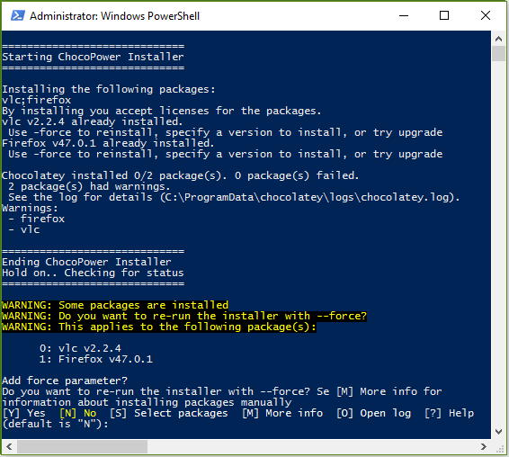

# ChocoPower
Smart chocolatey installer for PowerShell

<<<<<<< HEAD
## To-do
[ ] Parameter that accepts several packages (`.\setup.ps1 -install ruby vlc python`)
[ ] Select which package(s) to be forced
[ ] Parse error messages
[ ] Decide whether to modify the chocolatey.log or not (e.g. insert some custom log)
[ ] Clean up the code

!(chocopower.png)
=======

>>>>>>> origin/master
