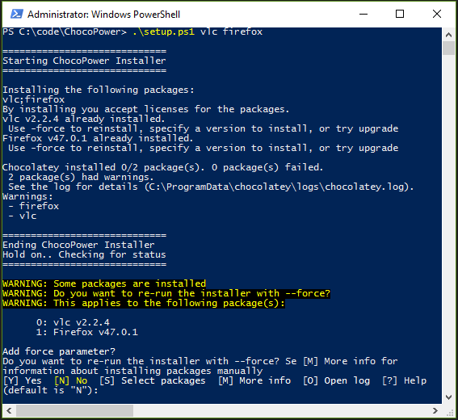

# ChocoPower
Smart chocolatey installer for PowerShell. It is under heavy development. Weird stuff may appear in code.

## To-do
- [x] Parameter that accepts several packages (`.\setup.ps1 ruby vlc python`)
- [x] Select which package(s) to be forced
- [ ] Parsing XML-files (packages.config) properly and giving an option to select which packages to force
- [ ] When trying to reinstall older versions of packages the user should be informed about this in a proper way and be given some options
- [ ] Parse error messages
- [ ] Decide whether to modify the chocolatey.log or not (e.g. insert some custom log)
- [ ] Clean up the code

